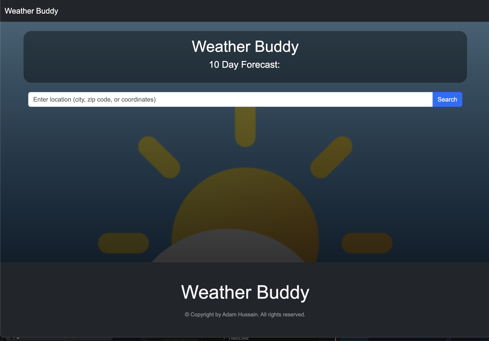

# Work Day Scheduler Starter Code
# Weather Buddy

## Table of Contents

* [Description](#description)
* [User Story](#user-story)
* [Acceptance Criteria](#acceptance-criteria)
* [Technologies Used](#technologies-used)
* [Developer](#developer)
* [Links](#link-to-application)

## Description
Welcome to Weather Buddy! This app takes a user search for city names, zip codes, and lat/long coordinates around the entire world, and displays a 10 day weather forecast for the searched location, including current conditions. The date, temperature, high, low, humidity, wind, and an icon are displayed for each day. All user searches are saved in the "recent searches" section, and each recent search is clickable and re-runs the search when clicked. The location that is retrieved based on the user search is displayed on the top of the page as the forecast is shown. 

## User Story
AS A traveler
I WANT to see the weather outlook for multiple cities
SO THAT I can plan a trip accordingly

## Acceptance Criteria

GIVEN a weather dashboard with form inputs
WHEN I search for a city
THEN I am presented with current and future conditions for that city and that city is added to the search history
WHEN I view current weather conditions for that city
THEN I am presented with the city name, the date, an icon representation of weather conditions, the temperature, the humidity, and the the wind speed
WHEN I view future weather conditions for that city
THEN I am presented with a 5-day forecast that displays the date, an icon representation of weather conditions, the temperature, the wind speed, and the humidity
WHEN I click on a city in the search history
THEN I am again presented with current and future conditions for that city

## Technologies Used

Built with:
* HTML5
* CSS
* JavaScript
* Visual Crossing Weather API

## Developer
* Adam Hussain

## Link to Application

## Link to GitHub Repository

### 
[Back to Top](#weather-buddy)
 
